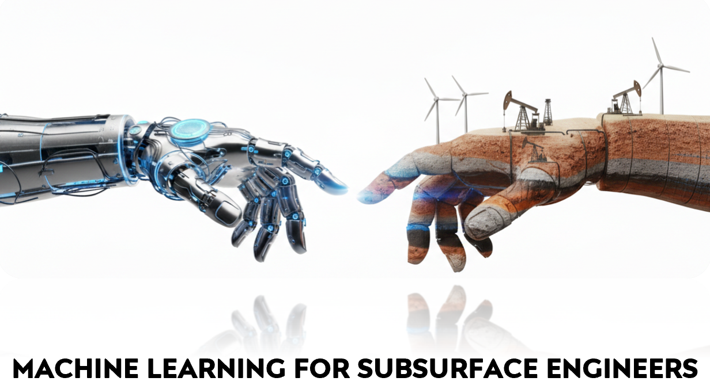

 
This repository is dedicated to applications of Machine Learning across various subsurface disciplines, including geology, geophysics, drilling, petroleum, and reservoir engineering. The goal of the program is to equip university students with an intuitive understanding of Machine Learning algorithms via hands-on exercises and derivations. It starts with the fundamentals of predictive subsurface modeling and how it differs from traditional prediction problems. Various supervised and unsupervised algorithms and best practices for model generalization are covered. The lecture series concludes with specialized sessions on quantifying model uncertainty and the explainability of algorithms in business environments. We hope this intuitive learning will equip users with a deep understanding of the models used—including their pros and cons—and make it easier to combine them with domain expertise.

The material was initially created as a collaboration for a lecture series with the [SEG](https://seg.org/). Because it is intended for use in live lectures, some slides are left for completion or further explanation. Repository will be extended with additional learning materials and more advanced topics, and contributions are welcome.

### Prerequisites:

- Basics of Probability and Statistics (Probability distributions, measures of spread)
- Basics of programming in any general-purpose language
- Basics of linear algebra (Matrix operations, Systems of linear equations)

### Usage and sharing
These materials are intended only for personal learning and should not be used for any financial purposes. Please make sure to cite the repository when sharing.

### Authors:

[**Dursun Dashdamirov**](https://www.linkedin.com/in/dursun-dashdamirov/)  
(PhD student at UT Austin)

[**Nadir Zeynalli**](https://www.linkedin.com/in/nadir-zeynalli/)  
(ML researcher at eiLink R&D)